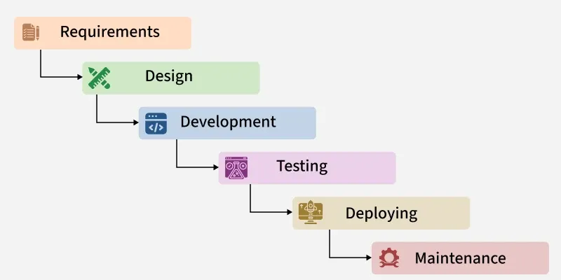

# Topic 1: Flow of SDLC & Waterfall Model

##  Table of Contents
1. [What is SDLC?](#what-is-sdlc)
2. [Importance of SDLC](#importance-of-sdlc)
3. [Phases of SDLC](#phases-of-sdlc)
4. [Flow of Each Phase](#flow-of-each-phase)
5. [Real-Life Examples](#real-life-examples)
6. [Waterfall Model](#waterfall-model)
7. [Pros and Cons of Waterfall](#pros-cons)
8. [When to Use Waterfall](#when-to-use)
9. [QA in Waterfall](#qa-in-waterfall)
10. [Limitations of Sequential Models](#limitations)

---

## What is SDLC?

### Definition
**Software Development Life Cycle (SDLC)** is a structured process that defines the steps involved in developing software from initial concept to deployment and maintenance.

### Easy Example
Think of SDLC like **building a house**:

```
Building a House:
1. Planning - What type of house? Budget? Timeline?
2. Design - Draw blueprints, plan layout
3. Construction - Actually build the house
4. Inspection - Check if built correctly
5. Move-in - Occupy and use house
6. Maintenance - Repair and maintain

Building Software:
1. Requirement Analysis - What should software do?
2. Design - Plan architecture and features
3. Development - Write code
4. Testing - Check if it works
5. Deployment - Release to users
6. Maintenance - Support and updates
```

### Why SDLC Matters

Without SDLC:
-  No clear plan
-  Chaos and confusion
-  Projects fail
-  Wasted time and money

With SDLC:
-  Clear plan
-  Organized process
-  Better quality
-  Predictable timeline

---

## Importance of SDLC in Software Projects

### 1. **Provides Structure**
```
Without SDLC:
Developer: "Let me just start coding"
Result: Disorganized code, confusion

With SDLC:
Clear phases → Clear goals → Organized work
```

### 2. **Manages Complexity**
```
Large Project: 100 developers, 2 years, 50 features
SDLC breaks it into:
- Planning (understanding requirements)
- Design (planning architecture)
- Development (coding in organized way)
- Testing (finding issues)
- Deployment (releasing safely)
- Maintenance (supporting users)
```

### 3. **Reduces Costs**
```
Project Cost Example:
Without SDLC: $500,000 + $300,000 (fixing errors) = $800,000
With SDLC: $500,000 (errors prevented) = $500,000
Savings: $300,000 (37.5% savings!)
```

### 4. **Ensures Quality**
```
Quality Timeline:
Phase 1: Plan quality standards
Phase 2: Design with quality in mind
Phase 3: Code following standards
Phase 4: Test thoroughly
Phase 5: Deploy only if quality met
Phase 6: Support to maintain quality
```

### 5. **Manages Risks**
```
Example:
Requirement: "Build an app for 1 million users"
SDLC addresses:
- Performance risk (test with load)
- Security risk (security testing)
- Data loss risk (backup planning)
- Scalability risk (architecture review)
```

### 6. **Improves Communication**
```
With SDLC:
- Requirements clearly documented
- Designers see what to build
- Developers see architecture
- Testers know what to test
- Everyone aligned!
```

### 7. **Enables Tracking**
```
Progress Tracking:
Week 1-2: Requirements done 
Week 3-4: Design done 
Week 5-6: Development 50% done 
Week 7-8: Testing in progress 
```

---

## Phases of SDLC

### Overview of All Phases

```
SDLC Phases:

1. REQUIREMENT ANALYSIS
   ↓ (Input: Business needs)
   ↓ (Output: Requirements document)

2. DESIGN
   ↓ (Input: Requirements)
   ↓ (Output: Design document, architecture)

3. IMPLEMENTATION (Development)
   ↓ (Input: Design)
   ↓ (Output: Source code)

4. TESTING
   ↓ (Input: Code and requirements)
   ↓ (Output: Test results, bug reports)

5. DEPLOYMENT
   ↓ (Input: Tested code)
   ↓ (Output: Live software)

6. MAINTENANCE
   ↓ (Input: User feedback)
   ↓ (Output: Updates and patches)
```

### Detailed Phase Description

#### Phase 1: Requirement Analysis
**Goal**: Understand what software should do

**Activities**:
```
1. Meet with stakeholders (customers, managers)
2. Document business needs
3. Identify features required
4. Define constraints and limitations
5. Create requirement document
6. Get stakeholder approval
```

**Inputs**:
- Business problem/opportunity
- Customer needs
- Market analysis

**Outputs**:
- Requirements document
- Functional specifications
- Non-functional requirements

**Stakeholders Involved**:
- Business Analyst
- Product Manager
- Customer/Client
- QA (to check testability)

**Example: Building an E-commerce App**
```
Stakeholder: "We need an online store"

Requirements gathered:
1. Users should browse products
2. Users should add items to cart
3. Users should checkout and pay
4. Users should see order history
5. Admin should manage inventory
6. System should handle 1000 users
7. Payment should be secure

Document created with all these details
```

**QA Involvement**:
- Review requirements for clarity
- Identify testability issues
- Ask clarifying questions
- Plan testing approach

---

#### Phase 2: Design
**Goal**: Plan how software will be built

**Activities**:
```
1. Create system architecture
2. Design database schema
3. Plan user interface
4. Define APIs and interfaces
5. Plan security approach
6. Create design document
```

**Inputs**:
- Requirements document
- Technical constraints
- Technology choices

**Outputs**:
- System architecture diagram
- Database design
- UI mockups/wireframes
- API documentation
- Design document

**Stakeholders Involved**:
- Architect
- Senior Developers
- Database Designer
- UI/UX Designer
- QA

**Example: E-commerce App Design**
```
Architecture:
Frontend (React) → Backend (Node.js) → Database (MySQL)

Database Design:
Users table: id, email, password, address
Products table: id, name, price, inventory
Orders table: id, user_id, product_id, quantity

UI Design:
Homepage → Product List → Product Detail → Cart → Checkout

Security:
- Passwords encrypted (bcrypt)
- Payment data tokenized
- HTTPS for all connections
```

**QA Involvement**:
- Review design for testability
- Identify edge cases
- Plan test scenarios
- Suggest improvements

---

#### Phase 3: Implementation (Development)
**Goal**: Write the actual code

**Activities**:
```
1. Write source code following design
2. Implement features
3. Write unit tests
4. Code reviews
5. Version control commits
6. Code documentation
```

**Inputs**:
- Design document
- Requirements
- Technology stack

**Outputs**:
- Source code
- Code documentation
- Build artifacts

**Stakeholders Involved**:
- Developers
- Tech Lead
- Code Reviewers
- DevOps (for deployment prep)

**Example: E-commerce Development**
```
Frontend Developer:
- Build product listing page
- Create shopping cart UI
- Build checkout form

Backend Developer:
- Create user authentication API
- Implement product API
- Build order processing API

Database Developer:
- Create database tables
- Set up relationships
- Optimize queries
```

**QA Involvement**:
- Monitor code quality (reviews)
- Identify potential bugs
- Provide test data requirements
- Prepare test environment

---

#### Phase 4: Testing
**Goal**: Find and report defects

**Activities**:
```
1. Create test plans
2. Design test cases
3. Execute tests
4. Report bugs
5. Verify bug fixes
6. Create test reports
7. Test closure
```

**Inputs**:
- Source code
- Requirements
- Design

**Outputs**:
- Test cases
- Bug reports
- Test results
- Quality metrics

**Stakeholders Involved**:
- QA Engineers
- Test Leads
- Developers (fix bugs)
- Product Owner (verify fixes)

**Example: E-commerce Testing**
```
Test Cases Created:
1. Valid login with correct credentials
2. Login with wrong password
3. Add product to cart
4. Remove product from cart
5. Checkout with valid card
6. Checkout with invalid card
7. Order history display
8. Performance with 1000 users

Bugs Found:
1. Cart doesn't update after adding item
2. Payment fails for international cards
3. Order email not sending
4. Page slow on 3G connection

Bug Results:
Reported → Developers fix → Re-test → Verify fix
```

**QA Role**:
- Lead all testing activities
- Ensure quality standards met
- Report to management
- Approve release

---

#### Phase 5: Deployment
**Goal**: Release software to users

**Activities**:
```
1. Prepare deployment plan
2. Setup production environment
3. Deploy code to production
4. Run smoke tests
5. Monitor for issues
6. Announce to users
7. Provide support
```

**Inputs**:
- Tested code
- Deployment plan
- Release notes

**Outputs**:
- Live software
- Release documentation
- User guides

**Stakeholders Involved**:
- DevOps Engineer
- System Administrator
- QA (smoke testing)
- Support Team
- Product Manager

**Example: E-commerce Deployment**
```
Deployment Plan:
1. Deploy at 2 AM (low traffic)
2. Database migrations
3. Update web servers
4. Update mobile apps (app store)
5. Test key features (smoke test)
6. Monitor system
7. Send announcement email
8. Support team ready for issues
```

**QA Involvement**:
- Smoke testing (critical features)
- Performance monitoring
- Issue escalation
- Approval to go-live

---

#### Phase 6: Maintenance
**Goal**: Support software and fix issues

**Activities**:
```
1. Monitor system performance
2. Fix bugs reported by users
3. Implement small improvements
4. Provide technical support
5. Plan future versions
6. Apply security patches
```

**Inputs**:
- User feedback
- Bug reports
- Performance data
- Security alerts

**Outputs**:
- Bug fixes
- Performance improvements
- Updates and patches
- New versions

**Stakeholders Involved**:
- Support Team
- Maintenance Developers
- QA
- Product Manager

**Example: E-commerce Maintenance**
```
Month 1 (After launch):
- Users report: Payment button broken on Safari
  Action: Fix bug, release patch

Month 2:
- Users request: Wishlist feature
  Action: Plan and develop

Month 3:
- Security vulnerability found
  Action: Release security patch immediately

Ongoing:
- Monitor performance
- Fix bugs
- Add improvements
- Support users
```

**QA Involvement**:
- Test bug fixes
- Verify improvements
- Performance testing
- Regression testing

---

## Flow of Each Phase with Real-Life Examples

### Example 1: Building a Banking Mobile App

#### Phase 1: Requirements
```
Timeline: Week 1-2
Goal: Understand banking requirements

Gathering:
- Customer interviews
- Compliance review (banking regulations)
- Feature brainstorming
- Competitor analysis

Key Requirements:
1. Secure login (biometric + password)
2. View account balance
3. Transfer money
4. Pay bills
5. Mobile check deposit
6. Transaction history
7. 24/7 availability
8. Must comply with PCI-DSS (payment standard)
9. Must encrypt all data
10. Fraud detection required

Output: 50-page requirements document
Stakeholders: Bank, Compliance team, Customers
```

#### Phase 2: Design
```
Timeline: Week 3-4
Goal: Plan the banking app

Architecture:
- Frontend: React Native (iOS + Android)
- Backend: Java microservices
- Database: PostgreSQL
- Security: OAuth2, encryption

Database Design:
- Users table
- Accounts table
- Transactions table
- Fraud detection logs

UI Design:
- Login with biometric
- Home with balance
- Transfer interface
- Transaction history

Security Design:
- 256-bit encryption
- API authentication
- Fraud detection algorithm
```

#### Phase 3: Development
```
Timeline: Week 5-8
Goal: Write the code

Teams:
- Mobile team (5 developers)
  → Login screen
  → Dashboard
  → Transfer UI

- Backend team (8 developers)
  → Authentication API
  → Account API
  → Transaction API
  → Fraud detection

- Database team (2 developers)
  → Database setup
  → Query optimization
  → Backup system

Daily code reviews, unit tests
Code repository: GitHub
```

#### Phase 4: Testing
```
Timeline: Week 9-10
Goal: Find all bugs

QA Activities:
- Functional testing: 500 test cases
- Security testing: Penetration testing
- Performance testing: 10,000 concurrent users
- Compliance testing: Banking regulations
- Mobile testing: iOS + Android devices

Results:
- 150 bugs found
- 50 critical bugs
- 50 major bugs
- 50 minor bugs

Fixes and re-testing:
- Week 9: Report bugs
- Week 10: Developers fix
- Week 10: Re-test all
- All bugs fixed!
```

#### Phase 5: Deployment
```
Timeline: Week 11
Goal: Release to users

Plan:
- Deploy backend to production
- Update database
- Publish to App Store
- Publish to Google Play
- Announce to customers

Day of deployment:
- 2 AM: Backend deployment
- 3 AM: Database migration
- 4 AM: Mobile apps updated
- 5 AM: Smoke testing
- 6 AM: Customer email announcement
- 6 AM onwards: Monitor for issues

Result: Successful launch! 100,000 downloads week 1
```

#### Phase 6: Maintenance
```
Timeline: Ongoing
Goal: Support users

First month:
- Monitor performance
- 98.9% uptime 
- 50,000 active users
- 5 minor bugs fixed
- 1 security patch released

Ongoing:
- Add new features quarterly
- Performance improvements
- Security updates
- Customer support
- Bug fixes
```

---

## Waterfall Model

### What is Waterfall?

**Definition**: A software development model where development flows sequentially through phases like a waterfall - each phase must be completed before the next begins.

### Waterfall Flow Diagram

```
Requirements
    │
    ↓ (Requirements completed, move to design)
Design
    │
    ↓ (Design completed, move to development)
Development
    │
    ↓ (Development completed, move to testing)
Testing
    │
    ↓ (Testing completed, move to deployment)
Deployment
    │
    ↓ (Deployed, move to maintenance)
Maintenance


Key Point: CAN'T GO BACK UP (Like a waterfall, can't flow upward!)
```

### Waterfall Structure

```
Waterfall Project Structure:
├─ Phase 1: Requirements (100% complete before moving)
├─ Phase 2: Design (100% complete before moving)
├─ Phase 3: Development (100% complete before moving)
├─ Phase 4: Testing (100% complete before moving)
├─ Phase 5: Deployment (100% complete before moving)
└─ Phase 6: Maintenance (Ongoing support)

No overlap = Strict linear progression
```

### Waterfall Characteristics

#### 1. **Sequential**
- Phases happen one after another
- No parallel activities
- Clear start and end for each phase

#### 2. **Fixed Requirements**
- All requirements defined upfront
- Hard to change later
- Customers need to know exactly what they want

#### 3. **Documentation Heavy**
- Comprehensive documentation for each phase
- Design document before coding
- Requirements document before design
- Everything documented

#### 4. **Testing Late in Cycle**
- Testing starts after all development done
- Bug fix time limited
- Late issue discovery

#### 5. **Big Bang Release**
- All features released at once
- Not gradual
- Either all works or all fails

### Waterfall Example Timeline

```
E-commerce Project (12-month timeline):

Month 1: Requirements Analysis
├─ Customer meetings
├─ Document all features needed
├─ Get approval
└─ Result: 100-page requirements doc

Month 2-3: System Design
├─ Architect the system
├─ Design database
├─ Design UI
└─ Result: Design documents ready

Month 4-8: Development
├─ Write code (5 months)
├─ Code reviews
├─ 50,000 lines of code
└─ Result: Code ready

Month 9-10: Testing
├─ Test entire system
├─ Find 200 bugs
├─ Fix bugs (1 month)
└─ Result: Tested code

Month 11: Deployment
├─ Deploy to production
├─ Setup infrastructure
├─ Go live
└─ Result: Live system

Month 12: Maintenance
├─ Support users
├─ Minor fixes
└─ Plan next version
```

---

## Pros and Cons of Waterfall

###  Advantages of Waterfall

#### 1. **Clear Planning**
```
Advantage: Know exactly what to build
Example: Building a bridge
- Blueprints exact
- Cost calculated accurately
- Timeline predictable
```

#### 2. **Good for Fixed Requirements**
```
Advantage: When requirements don't change
Example: Government system
- Regulations fixed
- Requirements stable
- Won't change mid-project
```

#### 3. **Comprehensive Documentation**
```
Advantage: Everything documented
Example: Large team
- New developer can read docs
- Understand system
- Not dependent on person's knowledge
```

#### 4. **Easy to Track Progress**
```
Advantage: Clear milestones
Example: Month 1 done → Month 2 done → etc.
Easy to report to management
```

#### 5. **Works for Large Teams**
```
Advantage: Teams can work independently
Example:
- Design team does design
- Dev team codes separately
- Minimal coordination needed
```

###  Disadvantages of Waterfall

#### 1. **No Flexibility**
```
Problem: Hard to change requirements
Example:
Month 5: Customer: "Actually, I want a different login method"
Response: "Too late! Already designed and coded the old way"
Cost: $50,000 to rebuild
```

#### 2. **Late Bug Discovery**
```
Problem: Bugs found too late
Example:
Month 9: Testing finds database isn't scalable
Need to redesign (Month 2 work)
But already in Month 9!
```

#### 3. **Long Time to Market**
```
Problem: Takes 12 months to release
Example:
- Month 1-8: Building
- Month 9: Testing
- Month 10-12: Fixing issues and getting it live
- By Month 12: Competitor already released similar product!
```

#### 4. **High Risk**
```
Problem: All or nothing at the end
Example:
Day 1: Start building
Month 11: First release
If something's wrong → Entire project fails!
No way to get partial feedback
```

#### 5. **Assumes Perfect Upfront Understanding**
```
Problem: Humans can't predict everything
Example:
Month 1: "We want blue button"
Month 8: User feedback: "Actually, we need red button"
Month 9: Testing: "But we already built and tested blue button!"
```

---

## When to Use Waterfall Model

### Best Scenarios for Waterfall

####  1. **Fixed, Well-Defined Requirements**
```
Example 1: Government Project
- Requirements: Military specifications (very detailed)
- Change: Not allowed
- Budget: Fixed
- Timeline: Fixed

Use Waterfall: YES
Why: Requirements won't change
```

```
Example 2: Banking System Upgrade
- Requirements: Exact regulatory requirements (federal law)
- Change: Can't change federal requirements
- Budget: Approved by board
- Timeline: Regulatory deadline

Use Waterfall: YES
Why: Requirements fixed by law
```

####  2. **Large Projects with Fixed Scope**
```
Example: Building Airport Management System
- Features: All defined upfront
- Size: 200 developers
- Duration: 3 years
- Teams: Separate design, dev, testing teams

Use Waterfall: YES
Why:
- Need clear planning for 200 people
- Teams can work independently
- Scope won't change
```

####  3. **Projects with Hardware/Embedded Systems**
```
Example: Automobile software
- Hardware: Physical, can't change easily
- Requirements: Safety-critical
- Testing: Extensive, then car shipped
- Can't update after manufacturing

Use Waterfall: YES
Why:
- Hardware constraints
- Can't iterate
- Must be right first time
```

####  4. **Regulated Industries**
```
Example: Healthcare software
- Regulations: FDA requirements
- Documentation: Required by law
- Testing: Extensive
- Changes: Need approval

Use Waterfall: YES
Why:
- Regulatory requirements
- Compliance documentation needed
- Heavy documentation matches Waterfall
```

####  5. **Well-Understood Domains**
```
Example: Paying bills online (already proven concept)
- Requirements: Known (similar to existing systems)
- Technology: Proven
- Risks: Low (done before)
- Timeline: Predictable

Use Waterfall: YES
Why:
- Requirements clear from start
- Proven approach
- Low uncertainty
```

###  When NOT to Use Waterfall

```
 Startup with unclear vision
 New technologies/untested approaches
 Fast-changing market/requirements
 Customer feedback needed early
 Frequent requirement changes expected
 Innovation required
```

---

## QA in Waterfall

### QA Timeline in Waterfall

```
Month 1-2: Requirements & Design
QA Role:
- Review requirements for testability
- Suggest testing approach
- Plan testing strategy
- Identify risks

Output: Test plan document

Month 3-8: Development
QA Role:
- Monitor code quality
- Prepare test cases
- Setup test environment
- Create test data

Output: Test cases ready

Month 9-10: Testing (MAIN QA PHASE)
QA Role:
- Execute all test cases
- Report all bugs
- Retest fixes
- Verify quality

Output: Bug reports, test results

Month 11: Deployment
QA Role:
- Smoke testing
- Verify deployment
- Monitor production

Month 12: Maintenance
QA Role:
- Test fixes
- Support users
```

### QA Challenges in Waterfall

#### 1. **Limited Time for Testing**
```
Problem: Only 2 months (Month 9-10) to test everything
- 50,000 lines of code
- 500+ features
- Only 2 months
- Must test and fix all issues in 2 months
```

#### 2. **Late Bug Discovery**
```
Example:
Month 9: Testing finds database not scalable
Problem: Database design done in Month 2!
Fix: Redesign from scratch
Cost: $100,000+
```

#### 3. **High Pressure**
```
Example:
Deployment scheduled for Month 11
Month 9-10: Find 500 bugs
Must fix all in 1 month!
QA under extreme pressure
```

#### 4. **No User Feedback Until End**
```
Problem:
Month 1: Design based on assumption
Month 9: First testing by real testers
Month 11: First release to users
What if design is wrong?
Too late to change!
```

---

## Limitations of Sequential Models

### 1. **Inflexibility**
```
Problem: Hard to adapt to change
Real scenario:
Month 5: Customer wants different feature
Response: Can't change, too far along
Result: Customer unhappy

Modern market: Changes happen, need flexibility
```

### 2. **Integration Issues**
```
Problem: Parts built separately, integrated late
Example:
- Frontend team builds login screen
- Backend team builds authentication API
- First integration in Month 9 (Testing phase)
Result: Login doesn't work with API!
Late discovery = expensive fix
```

### 3. **Cannot Adapt to Market**
```
Problem: Market changes during project
Real example:
- January: Start project (market wants feature A)
- March: Market shifts to want feature B
- August: Release with feature A
- Market already moved on!
Competitor released feature B months ago
```

### 4. **Employee Turnover Risk**
```
Problem: Person leaves, knowledge lost
Example:
- Database designer works Month 2 (Design phase)
- Designer leaves Month 8 (Development phase)
- Month 9 (Testing): Issues with database design
- Nobody remembers why designed that way!
```

### 5. **Assumes Predictable Development**
```
Problem: Doesn't account for unknowns
Example:
- Design: "3 months should be enough"
- Reality: New technology issues, learning curve
- Actual: 5 months needed
- Timeline slips!
```

---

## Waterfall vs Real World

### Real-World Waterfall Project Story

```
Government Immigration System (True Story)

Plan:
- 18-month project
- $20 million budget
- All requirements upfront

Reality:
- Month 1-2: Requirements (100 pages)
- Month 3-4: Design (50 pages)
- Month 5-10: Development (delays, integration issues)
- Month 11-12: Testing (found 500+ bugs)
- Month 13-14: Fixing bugs
- Month 15-16: More issues found
- Month 17-18: Still fixing
- Month 19+: Finally done (36 months! 2x original)
- Cost: $60 million! (3x original)

Why it failed:
- Underestimated complexity
- Integration issues
- No early feedback
- Couldn't adapt to issues
```

---

## Key Takeaways

###  Waterfall Summary

1. **Sequential Approach**
   - One phase at a time
   - Can't go back

2. **Best for Fixed Requirements**
   - When you know exactly what to build
   - Requirements won't change
   - Regulated industries

3. **Comprehensive Planning**
   - Document everything
   - Plan thoroughly
   - Predict timeline

4. **Risky for Uncertain Projects**
   - If requirements might change
   - If learning is needed
   - If market is fast-changing

5. **QA Challenges**
   - Limited testing time
   - Late bug discovery
   - High pressure

---

## Summary Table

| Aspect | Waterfall |
|--------|-----------|
| **Flow** | Sequential, linear |
| **Flexibility** | Low |
| **Testing** | Late (Month 9-10) |
| **Changes** | Hard to implement |
| **Documentation** | Heavy |
| **Time to Release** | Long (12+ months) |
| **Risk** | High (all or nothing) |
| **Best For** | Fixed requirements |
| **Not For** | Uncertain/changing reqs |

---

##  Next Steps

1. **Review**: Understand Waterfall phases
2. **Compare**: Compare with Agile (next topic)
3. **Reflect**: When would you use Waterfall?
4. **Prepare**: Next topic is Agile & Scrum

---

**Last Updated**: 2026  
**Difficulty Level**: Beginner  
**Time to Complete**: 45-60 minutes

---

> **"Waterfall is good when requirements are clear, but what about when they're not?"** → That's where Agile comes in! (Next topic)
