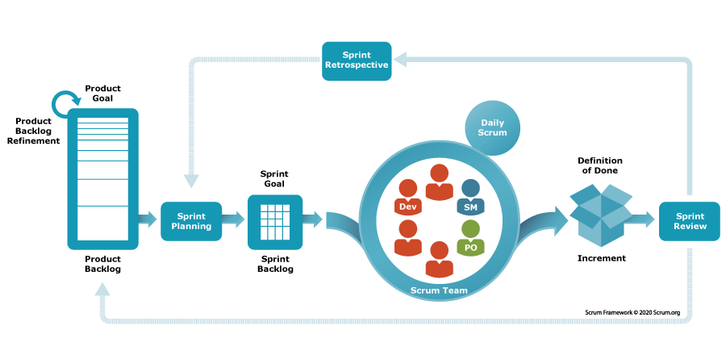

# Topic 2: Agile Process & Scrum Framework

##  Table of Contents
1. [Why Agile?](#why-agile)
2. [Agile Manifesto & Principles](#agile-manifesto-and-principles)
3. [Agile vs Waterfall](#agile-vs-waterfall)
4. [Key Agile Methodologies](#key-agile-methodologies)
5. [Scrum Framework](#scrum-framework)
6. [Scrum Roles](#scrum-roles)
7. [Scrum Ceremonies](#scrum-ceremonies)
8. [Sprint Lifecycle](#sprint-lifecycle)
9. [QA's Role in Agile](#qas-role-in-agile)
10. [Benefits for Fast-Changing Projects](#benefits-for-fast-changing-projects)

---

## Why Agile?

### The Problem with Waterfall

```
Waterfall Project Scenario:
Month 1-8: Building feature silently
Month 9: First demo to customer
Customer: "That's not what I wanted!"
Problem: Too late to change
Cost: $500,000 wasted

Why?
- No feedback during development
- Assumptions might be wrong
- Market might change
- Technology might change
```

### The Agile Solution

```
Agile Approach:
Sprint 1 (Week 1-2):
- Build small piece
- Demo to customer
- Get feedback
- Adjust accordingly

Sprint 2 (Week 3-4):
- Build next piece
- Demo again
- More feedback
- Keep improving

Result:
- Customer happy (constant feedback)
- Right product built
- Problems found early
- Fast to market
```

### Real-World Why Agile Needed

#### 1. **Markets Change Fast**
```
Example: Startup pivots
Month 1: "Let's build task management app"
Month 3: "Market research shows note-taking more popular"
Month 6: "Pivot to notes app"

Waterfall: Already built task app, too late
Agile: Can adapt, iterate, build notes app
```

#### 2. **Technology Evolves**
```
Example: New security framework
You start project with old framework
New better framework released
Waterfall: Can't change, use old framework
Agile: Adapt, use new framework in next sprint
```

#### 3. **Customer Learning**
```
Waterfall: Customers don't know what they want until month 9
Agile: Customer learns over sprints 1, 2, 3...
        Feedback improves the product continuously
```

#### 4. **Reduces Risk**
```
Waterfall: All or nothing at end
Result: Big failure possible

Agile: Small releases continuously
Result: If something fails, it's small, not massive
```

---

## Agile Manifesto and Principles

### The Agile Manifesto (2001)

Four core values (left side > right side):

```
1. INDIVIDUALS AND INTERACTIONS > Processes and Tools
   Meaning: People and communication matter more than tools

2. WORKING SOFTWARE > Comprehensive Documentation
   Meaning: Actual working code matters more than documentation

3. CUSTOMER COLLABORATION > Contract Negotiation
   Meaning: Working with customer matters more than contract

4. RESPONDING TO CHANGE > Following a Plan
   Meaning: Adapting to change matters more than following plan
```

### 12 Agile Principles

[Click here for full Agile Manifesto](https://agilemanifesto.org/principles.html)

#### 1. **Customer Satisfaction**
"Our highest priority is to satisfy the customer through early and continuous delivery of valuable software."

**Example**:
```
Waterfall: Deliver after 12 months
Agile: Deliver features in weeks, get feedback, improve
```

#### 2. **Welcome Change**
"Welcome changing requirements, even late in development."

**Example**:
```
Sprint 5: Customer: "We need a new feature"
Agile: "Sure! Let's add it in Sprint 6"
Waterfall: "Too late, locked in"
```

#### 3. **Deliver Frequently**
"Deliver working software frequently, from couple of weeks to couple of months."

**Example**:
```
Every 2 weeks: New version released with new features
Users get improvements constantly
```

#### 4. **Work Together**
"Business people and developers must work together daily."

**Example**:
```
Daily standup with Product Owner
Constant communication
Everyone aligned
```

#### 5. **Trust and Support**
"Build projects around motivated individuals. Give them the environment and support they need."

**Example**:
```
Team: "We need better tools"
Manager: "Done, here they are"
Team: Motivated, productive
```

#### 6. **Face-to-Face Communication**
"The most efficient and effective method of conveying information is face-to-face conversation."

**Example**:
```
Instead of: Email thread (10 emails, confusion)
Better: 5-minute conversation, everyone clear
```

#### 7. **Working Software is Success**
"Working software is the primary measure of progress."

**Example**:
```
Progress is not:
-  50% code written
-  Design done
-  Meeting attended

Progress is:
-  Feature works
-  User can use it
-  Adds value
```

#### 8. **Sustainable Pace**
"Agile processes promote sustainable development. Sponsors, developers, and users should be able to maintain a constant pace indefinitely."

**Example**:
```
Don't: Work 80 hours/week to meet deadline
Instead: Work 8 hours/day at sustainable pace
Better long-term quality and health
```

#### 9. **Technical Excellence**
"Continuous attention to technical excellence and good design enhances agility."

**Example**:
```
Write clean code
Regular refactoring
Good architecture
Testing automated
```

#### 10. **Simplicity**
"The art of maximizing the amount of work not done is essential."

**Example**:
```
Build only what's needed
Don't add "nice to have" features
Focus on core value
```

#### 11. **Self-Organizing Teams**
"The best architectures, requirements, and designs emerge from self-organizing teams."

**Example**:
```
Don't: Manager tells exactly what to do
Instead: Team figures out how to solve problem
Better solutions from team collaboration
```

#### 12. **Continuous Improvement**
"At regular intervals, the team reflects on how to become more effective, then tunes and adjusts its behavior accordingly."

**Example**:
```
Every sprint: Team retrospective
What went well? What to improve?
Continuous improvement
```

---

## Agile vs Waterfall

### Quick Comparison

| Aspect | Waterfall | Agile |
|--------|-----------|-------|
| **Approach** | Sequential, linear | Iterative, cyclical |
| **Requirements** | All upfront | Evolving |
| **Timeline** | 12+ months | 2-4 week sprints |
| **Release** | One big release | Frequent releases |
| **Testing** | Late phase | Continuous |
| **Change** | Hard | Easy |
| **Documentation** | Heavy | Light |
| **Customer Involvement** | End | Continuous |
| **Flexibility** | Low | High |
| **Risk** | High (all or nothing) | Low (small releases) |
| **Team Size** | Large, specialized | Small, cross-functional |

### Visual Comparison

```
WATERFALL:
Requirements → Design → Dev → Testing → Deploy → Done
   ↓            ↓        ↓      ↓         ↓
  Month 1    Month 2   Month 3-8 Month 9-10  Month 11
(Months of work before first feedback)

AGILE (Scrum):
Sprint 1 → Sprint 2 → Sprint 3 → Sprint 4 → Continue...
 2 weeks   2 weeks   2 weeks   2 weeks   (feedback after each!)

In each sprint: Design → Dev → Test → Demo (feedback!)
```

### Real-World Example: Building E-commerce App

#### Waterfall Approach
```
Month 1-2: Requirements
- Define 100 features needed
- Customer approves

Month 3-4: Design
- Design all features
- Architecture complete

Month 5-9: Development
- Code all features
- 50,000 lines written

Month 10-11: Testing
- Test all features
- Find 200 bugs
- Fix all bugs

Month 12: Deploy
- Release to market

Result: 12 months, 1 release, high risk
```

#### Agile Approach
```
Sprint 1 (Week 1-2): Core Features
- User login
- Product browse
- Add to cart
- Demo to customer
- Feedback: "Looks good, but UI needs improvement"

Sprint 2 (Week 3-4): Checkout
- Checkout page
- Payment integration
- Order confirmation
- Demo to customer
- Feedback: "Needs one-click checkout"
- Adjust: Add one-click option

Sprint 3 (Week 5-6): Advanced Features
- Wishlist
- Reviews
- Recommendations
- Demo to customer
- Feedback: "Love it! Ship it!"

Sprint 4 (Week 7-8): Optimization
- Performance improvements
- Mobile optimization
- Testing improvements

Result: 2 months minimum viable product, user feedback throughout, low risk
```

---

## Key Agile Methodologies

### Scrum (Most Popular)

```
Scrum is the most used Agile methodology

Key Points:
- 2-4 week sprints (called sprint)
- 3 roles: Scrum Master, Product Owner, Team
- 4 ceremonies: Planning, Daily standup, Review, Retrospective
- 1 artifact: Product backlog
- Clear rules and process

Market Share: 70-80% of Agile teams use Scrum
```

We'll cover Scrum in detail below.

---

### Kanban

```
Kanban = Continuous flow, not sprints

Key Points:
- No fixed sprints
- Work flows continuously
- Visual board (To Do → In Progress → Done)
- Limit work in progress (WIP limit)
- Pull-based (don't push work)

Example:
Max 3 items in "In Progress"
When done, pull new item
Focus on quality, not speed
```

Visual Example:
```
Kanban Board:
┌──────────────┬──────────────┬──────────────┐
│  To Do       │ In Progress  │ Done         │
├──────────────┼──────────────┼──────────────┤
│ • Login      │ • Payment    │ • Signup     │
│ • Search     │ • Cart       │ • Profile    │
│ • Reviews    │              │ • Dashboard  │
└──────────────┴──────────────┴──────────────┘

Rules:
- Max 2 items in progress
- Finish one before starting new
- Focus on quality
```

---

### Scrum vs Kanban

| Aspect | Scrum | Kanban |
|--------|-------|--------|
| **Sprints** | Fixed 2-4 weeks | Continuous |
| **Planning** | Sprint planning | On-demand |
| **Roles** | Product Owner, Scrum Master, Team | No fixed roles |
| **Releases** | End of sprint | Continuous |
| **Change** | After sprint | Anytime |
| **Metrics** | Velocity | Lead time, Cycle time |
| **Best For** | Projects with clear goals | Support, maintenance |

---

## Scrum Framework

### What is Scrum?

**Definition**: A framework for managing product development, especially software development, using iterative and incremental practices.

### Scrum Overview


### Scrum Artifacts

#### 1. **Product Backlog**
```
Definition: List of all features, improvements, fixes needed

Example: E-commerce Product Backlog
┌─────────────────────────────────────────────┐
│ Priority │ Feature          │ Effort  │ Status│
├─────────────────────────────────────────────┤
│    1     │ User Login       │ 8 pts   │ Done │
│    2     │ Product Browse   │ 5 pts   │ Done │
│    3     │ Add to Cart      │ 5 pts   │ Done │
│    4     │ Checkout         │ 13 pts  │ Doing│
│    5     │ Payment Gateway  │ 8 pts   │ Todo │
│    6     │ Wishlist         │ 5 pts   │ Todo │
│    7     │ Reviews          │ 8 pts   │ Todo │
│    8     │ Search           │ 13 pts  │ Todo │
│    9     │ Recommendations  │ 13 pts  │ Todo │
│    10    │ Admin Dashboard  │ 21 pts  │ Todo │
└─────────────────────────────────────────────┘

Owner: Product Owner (keeps it organized and prioritized)
```

#### 2. **Sprint Backlog**
```
Definition: Subset of product backlog selected for current sprint

Example: Sprint 1 Backlog (2-week sprint)
Target Velocity: 21 story points (team can do 21 pts/2 weeks)

┌─────────────────────────────────────┐
│ Feature          │ Effort  │ Status  │
├─────────────────────────────────────┤
│ User Login       │ 8 pts   │ Done    │
│ Product Browse   │ 5 pts   │ Done    │
│ Add to Cart      │ 8 pts   │ In Prog │
└─────────────────────────────────────┘
Total: 21 points = sprint capacity used

Owner: Development team
```

#### 3. **Increment**
```
Definition: Working product at end of sprint

Example: Sprint 1 Increment
├─ Working login system
├─ Product listing page
├─ Add to cart functionality
└─ No bugs blocking use

Every increment should be "potentially shippable"
```

---

## Scrum Roles

### 1. Product Owner (PO)

**Responsibility**: Represent the customer and manage product vision

**Duties**:
- Define product features
- Prioritize backlog
- Answer team questions
- Accept or reject completed work
- Talk to customers
- Make decisions about features

**Typical Day**:
```
9:00 AM: Customer meeting
        - Understand what they want
        - Gather requirements

10:00 AM: Update product backlog
         - Re-prioritize based on feedback
         - Write user stories

11:00 AM: Team meeting
         - Answer questions from developers
         - Clarify requirements

1:00 PM: Sprint review preparation
        - Plan what to demo
        - Get stakeholder list

2:00 PM: Backlog refinement
        - Prepare next sprint items
        - Estimate efforts
```

**Key Skills**:
- Understanding customer needs
- Business acumen
- Decision-making
- Communication

**NOT the same as**:
-  Project manager (PO focuses on what, not timeline)
-  Manager (PO doesn't manage team)
-  Developer (PO focuses on vision, not coding)

---

### 2. Scrum Master (SM)

**Responsibility**: Ensure Scrum process is followed and team is effective

**Duties**:
- Facilitate meetings
- Remove blockers
- Coach team on Scrum
- Protect team from interruptions
- Monitor team health
- Process improvement

**Typical Day**:
```
9:00 AM: Daily Standup (facilitate)
        - Each person: What did you do? What will you do? Blockers?

9:30 AM: Help developer
        - Dev stuck on task
        - SM helps remove blocker

10:00 AM: Attend design review
         - Ensure process is followed
         - Help team collaborate

1:00 PM: 1-on-1 with team member
        - How are they doing?
        - Any concerns?
        - Team happiness important

2:00 PM: Prepare retrospective
        - Plan sprint retrospective meeting
        - Identify discussion points

3:00 PM: Remove organizational blockers
        - IT request
        - Hardware needed
        - Help from other team
```

**Key Skills**:
- Facilitation
- Coaching
- Problem-solving
- Team building

**Scrum Master vs Project Manager**:
```
Project Manager:
- Controls timeline
- Assigns work
- Monitors progress
- Responsible for schedule

Scrum Master:
- Facilitates process
- Removes blockers
- Coaches team
- Responsible for effectiveness
```

---

### 3. Development Team

**Responsibility**: Build the product

**Who's on the team**:
- Developers
- QA/Testers
- UX Designer
- DevOps (sometimes)

**Size**: 5-9 people (optimal)

**Characteristics**:
- Cross-functional (has all skills needed)
- Self-organizing (decides how to work)
- Accountable (responsible for delivering)

**Typical Team Member Day**:
```
9:00 AM: Daily Standup (15 min)
        - I built login feature
        - I'll test checkout
        - Blocker: Database server down

9:15 AM: Development/Testing
        - Work on assigned task
        - Collaborate with teammates

12:00 PM: Lunch

1:00 PM: Code Review
        - Review teammate's code
        - Provide feedback

2:00 PM: Testing/Development
        - Continue work
        - Fix code review issues

3:00 PM: Team Discussion
        - Solve technical problem
        - Design solution

4:00 PM: Progress update
        - Update task status
        - Prepare for next day
```

**Team Accountability**:
- Estimates tasks
- Commits to sprint goal
- Delivers working software
- Quality is their responsibility
- Testing is part of development (not just QA's job)

---

### Three Roles Interaction Example

```
Sprint 1 Planning:

Product Owner:
"Here are top 5 prioritized features for next sprint"

Scrum Master:
"Great! Let's estimate them"
(Facilitates estimation meeting)

Development Team:
"We can do these 3 features = 21 points
We estimate to be done in 2 weeks"

Sprint 1 (Daily):

Developer:
"I'm stuck on payment integration"

Scrum Master:
"Let me help remove that blocker"
(Contacts payment vendor, gets help)

Developer:
"Thanks! Can continue now"

Product Owner:
"Any questions about requirements?"
Team: "No, clear!"

Sprint 1 End:

Development Team:
"Here are 3 completed features"

Product Owner:
"Great! I'll demo to customer"

Scrum Master:
"Perfect! Let's do retrospective"
(Facilitate reflection meeting)

Team:
"What went well? What to improve?"
(Continuous improvement)
```

---

## Scrum Ceremonies

### 1. Sprint Planning

**When**: Start of sprint (first day)

**Duration**: 2-4 hours for 2-week sprint

**Attendees**: Product Owner, Scrum Master, Development Team

**Goal**: Decide what team will work on in next sprint

**What Happens**:
```
1. PO presents prioritized backlog items
   "This is what customers want most"

2. Team discusses and asks questions
   Developer: "What does 'fast checkout' mean exactly?"
   PO: "User should complete in < 1 minute"
   Developer: "Got it, clear"

3. Team estimates effort
   Item 1: "8 story points (medium effort)"
   Item 2: "5 story points (small)"
   Item 3: "13 story points (large)"

4. Team commits to sprint goal
   SM: "How much can you do in 2 weeks?"
   Team: "We can do 21 points"
   SM: "Great! Those 3 items it is"

5. Team plans how to implement
   Dev1: "I'll build payment integration"
   Dev2: "I'll build checkout UI"
   QA: "I'll write test cases and test"
```

**Output**:
- Sprint backlog (what will be done)
- Sprint goal (overall objective)
- Task breakdown
- Team commitment

---

### 2. Daily Standup

**When**: Every morning (same time)

**Duration**: 15 minutes max (very short!)

**Attendees**: Development Team, Scrum Master, PO (optional)

**Goal**: Synchronize work and identify blockers

**Format**: Each person answers 3 questions:
```
1. What did I complete yesterday?
   "I finished the login form"

2. What will I do today?
   "I'll test login and start payment feature"

3. Do I have any blockers?
   "I need database access"
```

**Example Standup**:
```
Developer 1:
"Yesterday: Completed signup feature
Today: Test signup and add password validation
Blocker: None"

Developer 2:
"Yesterday: Started payment integration
Today: Continue payment, need design review
Blocker: Design not finalized yet"

QA:
"Yesterday: Tested login, found 3 bugs
Today: Retest login, test signup
Blocker: Need test environment setup"

Scrum Master:
"I'll help QA with test environment today
Designer, can you finalize payment flow?"

Everyone: Good! See you at daily standup tomorrow
```

**Why 15 minutes**:
- Quick sync, not long meeting
- Details discussed offline
- Focus on blockers only

---

### 3. Sprint Review

**When**: End of sprint (last day)

**Duration**: 1-2 hours for 2-week sprint

**Attendees**: Team, Product Owner, Stakeholders, Customers

**Goal**: Demo completed work and get feedback

**What Happens**:
```
1. Product Owner introduces sprint goal
   PO: "We wanted to build checkout feature"

2. Team demonstrates completed work
   Dev: "Here's the checkout page" (demo)
   QA: "Tested with these scenarios" (show tests)
   Team: "Everything working!"

3. Stakeholders/Customers provide feedback
   Customer: "Love it! But one thing..."
   Customer: "Can we add gift wrapping?"
   Stakeholder: "Perfect for our needs"

4. Discuss what's next
   PO: "Based on feedback, gift wrapping added to backlog"
   Team: "Understood"
```

**Important**: Only COMPLETED work is demo'd
- Not 90% done
- Not "almost done"
- Only fully tested, working features

**Output**:
- Customer/Stakeholder feedback
- Acceptance/rejection of work
- Ideas for next sprints

---

### 4. Sprint Retrospective

**When**: End of sprint (after review)

**Duration**: 45 min - 1.5 hours

**Attendees**: Development Team, Scrum Master

**Goal**: Team reflects on process and identifies improvements

**What Happens**:
```
Scrum Master facilitates:

1. What went well?
   "Communication was great"
   "We delivered on time"
   "Testing was thorough"

2. What could be improved?
   "Daily standup was too long (25 min, not 15)"
   "We need better documentation"
   "Pair programming helped, let's do more"

3. What will we commit to improve?
   "Let's keep standup to 15 minutes max"
   "We'll write better comments in code"
   "We'll pair program on complex features"
```

**Important**:
- Focus on PROCESS, not people
-  "Standup was too long"
-  Don't blame individuals
- Goal is continuous improvement

**Output**:
- List of improvements for next sprint
- Commitment to change
- Better team performance

---

## Sprint Lifecycle

### Visual Sprint Timeline

```
DAY 1 (Sprint Starts):
├─ Sprint Planning (2 hours)
│  └─ Team decides what to build
└─ Team starts work

DAY 2-9 (Sprint Execution):
├─ Daily Standup (9:00 AM, 15 min)
│  ├─ "Done yesterday"
│  ├─ "Doing today"
│  └─ "Blockers?"
├─ Development & Testing (full day)
└─ Blockers removed immediately

DAY 10 (Sprint Ends):
├─ Complete final work
├─ Final testing
├─ Sprint Review (2 hours)
│  └─ Demo to customers
├─ Sprint Retrospective (1.5 hours)
│  └─ Team reflects on improvements
└─ Celebrate! 

DAY 1 OF NEXT SPRINT:
└─ Sprint Planning begins again
```

### 2-Week Sprint Example

```
WEEK 1:
Mon 9 AM: Sprint Planning
  ├─ PO presents features
  ├─ Team estimates
  └─ Commit to sprint

Mon-Fri: Daily Standup 9:15 AM
        Development & Testing

Mon: Day 1
  Dev: Start payment integration
  QA: Design test cases
  Designer: Create UI mockups

Tue: Day 2
  Dev: Payment integration 50% done
  QA: Start writing test cases
  Blocker Found: Need design finalized
  SM: "Let me help unblock"

Wed: Day 3
  Dev: Payment integration 80% done
  QA: Running basic tests (found 2 bugs)
  Dev: Fixing bugs from QA

Thu: Day 4
  Dev: Payment integration done
  QA: Full regression testing
  Designer: Next UI ready

Fri: Day 5
  Dev: Code review and fixes
  QA: Final testing
  SM: Prepare sprint review

WEEK 2:
Mon-Wed: Continue sprint

Wed: Final work
  Dev: Fix final issues
  QA: Final testing
  Team: Prepare demo

Thu: Sprint Review & Retrospective
  2 PM: Sprint Review (30 min demo, 30 min feedback)
  3 PM: Sprint Retrospective (90 min reflection)

Fri: Sprint Planning for next sprint
  9 AM: Plan next sprint
  12 PM: Sprint starts!
```

---

## QA's Role in Agile

### QA in Agile is Different

#### Waterfall QA:
```
Month 1-8: No QA work
Month 9: Massive testing phase
Month 10: Bug fixes
Result: Rushed, high pressure
```

#### Agile QA:
```
Sprint 1: Test as we build
Sprint 2: Test as we build
Sprint 3: Test as we build
Result: Continuous, sustainable
```

### QA Responsibilities in Scrum

#### During Sprint Planning:
```
QA Reviews Requirements:
- Testable? (Can we test this?)
- Clear? (Do we understand it?)
- Complete? (Anything missing?)

QA Estimates Testing Effort:
- How long to test this feature?
- What test cases needed?
- Any special testing needed?

QA Commitment:
"I can test this in 3 days"
```

#### During Sprint Development:
```
Day 1: Requirements review
- QA reviews requirements
- QA writes test cases (before dev starts!)

Day 2-3: Development
- QA writes more test cases
- QA tests as dev finishes pieces

Day 4-5: Testing sprint goal
- QA fully tests completed features
- QA reports bugs
- Dev fixes bugs

Day 6: Final testing
- QA verifies all fixes
- QA marks feature "Ready to Demo"
```

#### During Sprint Review:
```
QA Participates in Demo:
- Demonstrates testing done
- Shows quality metrics
- Mentions any known issues
```

#### During Sprint Retrospective:
```
QA Contributes:
- "Communication with dev was great"
- "We need better test environment"
- "Pair testing with dev helped find more bugs"
```

### QA Practices in Agile

#### 1. **Test as You Build**
```
NOT: Wait for code, then test everything
INSTEAD: Test each piece as it's built
Result: Bugs found immediately, fixed immediately
```

#### 2. **Automate Repetitive Tests**
```
Regression tests: Run automatically every build
Example:
- Login test → 5 seconds automated
- Instead of 30 minutes manual
- Free up time for exploratory testing
```

#### 3. **Pair Testing with Dev**
```
Dev: "I just built this feature"
QA: "Let me test it right now"
QA finds bug immediately
Dev: "Oh! Let me fix"
QA: "Now it works!"

Benefit: Fast feedback, quality built in
```

#### 4. **Continuous Testing**
```
Not just: Functional testing
Also: Security, Performance, Accessibility
Throughout the sprint, not just at end
```

#### 5. **Quality Metrics**
```
Track: Bugs per sprint
     Defect density (bugs per 1000 lines code)
     Code coverage (% of code tested)
     Test execution time
Result: Monitor quality trends
```

---

## Benefits for Fast-Changing Projects

### 1. **Fast Time to Market**
```
Waterfall: 12 months to first release
Agile: 2-4 weeks to first release (MVP)
Benefit: Get feedback from real users early
Example: Startup can launch in 1 month vs 6 months
```

### 2. **Adapts to Change**
```
Market shifts: Competitor released similar product
Waterfall: Can't change, locked in design
Agile: Change next sprint, adapt product

Benefit: Stay competitive
```

### 3. **Reduces Risk**
```
Waterfall: Invest 12 months, all-or-nothing
Agile: Invest 2 weeks, small release, test market
If wrong: Only wasted 2 weeks, not 12 months
Benefit: Much lower risk
```

### 4. **Better Quality**
```
Waterfall: Test everything in 2 months (rushed)
Agile: Test continuously throughout sprints
Benefit: More thorough, higher quality
```

### 5. **Customer Satisfaction**
```
Waterfall: Build for 12 months, deliver, customer hates it
Agile: Build, demo every 2 weeks, adjust
Benefit: Customer happy, product is what they want
```

### 6. **Team Morale**
```
Waterfall: Work 12 months, may fail, demoralized
Agile: See progress every 2 weeks, celebrate wins
Benefit: Team motivated, happy
```

### 7. **Early Feedback**
```
Waterfall: Feedback at Month 12
Agile: Feedback at Week 2, 4, 6, etc.
Benefit: Learn and improve continuously
```

---

## Key Takeaways

###  Agile Summary

1. **Iterative Approach**
   - Small chunks of work
   - Regular feedback
   - Continuous improvement

2. **Best for Changing Requirements**
   - Markets change
   - Technology evolves
   - Customer learns what they want

3. **Risk Reduction**
   - Small releases
   - Fast feedback
   - Adapt quickly

4. **Team Empowerment**
   - Self-organizing teams
   - Ownership and accountability
   - Continuous learning

5. **QA Integration**
   - Testing throughout sprint
   - Bug prevention, not just detection
   - Quality built-in

---

## Agile vs Waterfall Summary

| Factor | Waterfall | Agile |
|--------|-----------|-------|
| **Best For** | Fixed requirements | Changing requirements |
| **Timeline** | 12+ months | 2-4 week sprints |
| **Testing** | Late, rushed | Continuous |
| **Release** | One big release | Frequent releases |
| **Change** | Hard | Easy |
| **Risk** | High | Low |
| **Customer** | Feedback at end | Feedback every sprint |
| **Team** | Specialized roles | Cross-functional |
| **Quality** | Variable | Consistent |

---

##  Next Steps

1. **Review**: Understand Scrum roles and ceremonies
2. **Practice**: Think through a sprint scenario
3. **Apply**: Use Agile principles in any project
4. **Prepare**: Move to STLC (Testing Life Cycle)

---

**Last Updated**: 2026  
**Difficulty Level**: Beginner  
**Time to Complete**: 60 minutes

---

> **"Agile isn't about working faster, it's about working smarter and adapting to change."**

