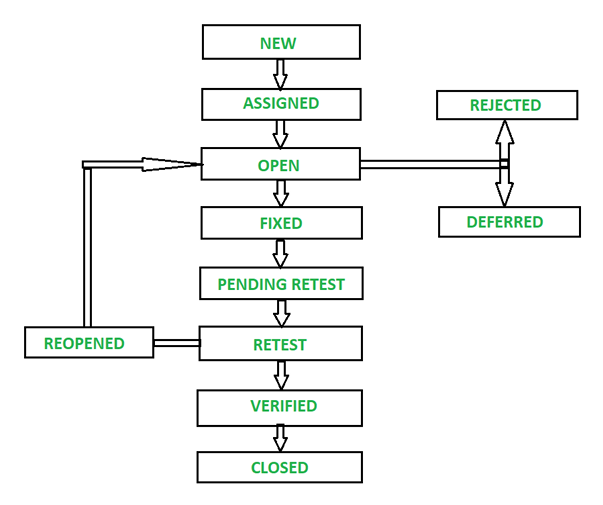

# Section 4: Fundamentals of Manual Testing

##  Table of Contents
### Topic 1: Test Execution, Defect Lifecycle, Bug Reporting & Test Closure
1. [What is Test Execution?](#what-is-test-execution)
2. [How to Prepare for Test Execution](#how-to-prepare-for-test-execution)
3. [Defect Lifecycle](#defect-lifecycle)
4. [Bug Reporting Best Practices](#bug-reporting-best-practices)
5. [Bug Tracking Tools (JIRA, Spreadsheet)](#bug-tracking-tools)
6. [Test Closure Activities](#test-closure-activities)
7. [Checklist Before Closing Testing](#checklist-before-closing-testing)

### Topic 2: Bug Findings, Bug Analysis & Manual Testing Process
8. [How to Identify and Confirm a Bug](#how-to-identify-and-confirm-a-bug)
9. [Understanding Root Cause](#understanding-root-cause)
10. [Categorizing Bugs](#categorizing-bugs)
11. [Manual Testing Process](#manual-testing-process)
12. [Role of Communication in QA](#role-of-communication-in-qa)
13. [Professional QA Do's & Don'ts](#professional-qa-dos--donts)
14. [Documentation & Teamwork](#documentation--teamwork)

---

## TOPIC 1: TEST EXECUTION & DEFECT LIFECYCLE

## What is Test Execution?

### Definition
**Test Execution** is the process of running test cases against the application and verifying if the actual results match the expected results.

### Simple Explanation
Think of test execution like **driving a car to check if it works**:

```
Before Execution:
- Car is built (software developed)
- Manual tells what to do (test cases)

During Execution:
- You drive the car (execute test steps)
- You check: Does steering work? Does brake work?
- You note: This works fine, this doesn't

After Execution:
- Report results: Good, bad, needs fixing
```

---

## How to Prepare for Test Execution

### Step 1: Verify Pre-Requisites

```
Before testing starts, check:

 Build is available and stable
  └─ Can download/access application
  
 Test environment is ready
  └─ Database setup
  └─ Server running
  └─ URLs accessible
  
 Test data is prepared
  └─ User accounts created
  └─ Sample data in database
  └─ Test credentials ready
  
 Test cases are ready
  └─ Reviewed and approved
  └─ Everyone understands them
  
 Testing tools available
  └─ Browser
  └─ Postman
  └─ JIRA for bug tracking
  └─ Excel for documentation
  
 Team is trained
  └─ QA understands test cases
  └─ QA knows what to do
  └─ Questions answered
```

---

### Step 2: Prepare Yourself

```
As a QA tester, prepare:

Mental:
- Clear mind (no distractions)
- Focused on testing (not rushing)
- Patient (test thoroughly)
- Curious (question everything)

Physical:
- Good internet connection
- Quiet environment
- Enough time (don't rush)
- Comfortable workspace

Knowledge:
- Know the test case well
- Understand requirements
- Know expected results
- Know how to report bugs
```

---

### Step 3: Check Communication

```
Before starting:
- Team meeting: "Any last changes?"
- Developer: "This version is stable"
- Product Owner: "These are priorities"
- Scrum Master: "Timeline is clear"
- Everyone: "Ready to test!"
```

---

## Defect Lifecycle

### What is a Defect?

**Definition**: A deviation from expected behavior. When actual result ≠ expected result.
### Defect Lifecycle Phases



---

### Detailed Defect Lifecycle


---

#### Stage 1: NEW

```
What happens:
- QA executes a test case and encounters a failure (Actual Result ≠ Expected Result)
- A brand-new bug is officially identified 
- QA drafts a clear Defect Document (Bug Report) detailing steps and parameters
- This document is sent to the Development team so they can pinpoint the source

Example:
Test Case: Add product to cart
Expected: Product count updates to 1
Actual: Product count stays at 0
Status: FAIL

JIRA Status: NEW
Assigned to: Unassigned (Awaiting triage)
Priority: [TBD]
Severity: [TBD]

```

#### Stage 2: ASSIGNED

```
What happens:
- The QA Lead or Project Manager reviews the newly filed ticket
- The bug is validated as real and approved for engineering resources
- The ticket is assigned directly to a specific development team member
- The system updates automatically to inform the engineer of the task

JIRA Status: ASSIGNED
Developer: john.dev@company.com
Notified: Yes (Automated email dispatched)

```

#### Stage 3: OPEN

```
What happens:
- The assigned developer opens the ticket and begins analyzing the codebase
- The engineer investigates the root cause and sets up replication efforts
- If the developer uncovers evidence that the ticket is invalid, incorrect, 
  or unfixable, they transition it here to alternative states (Rejected, Deferred, etc.)

JIRA Status: OPEN
Developer Comment: "Analyzing the cart validation controller script..."

```

#### Stage 4: FIXED

```
What happens:
- The developer finds the script error (e.g., missing variable or database update statement)
- The developer rewrites the flawed code and verifies the solution on their local setup
- Once code changes are finalized, they update the system to show the fix is done

JIRA Status: FIXED
Developer Comment: "Added missing update logic to the cart session object."

```

#### Stage 5: PENDING RETEST

```
What happens:
- The compiled software fix is deployed from the local machine to the Test Environment
- The code is handed off to the testing team
- The ticket waits in the QA queue until an engineer becomes free to validate it

JIRA Status: PENDING RETEST
Environment Build: v2.0-build-456

```

#### Stage 6: RETEST

```
What happens:
- A QA engineer claims the ticket from the queue and marks it as active
- The tester logs into the test build and reruns the original steps to check the fix

JIRA Status: RETESTING
Assigned Tester: sarah.qa@company.com

```

#### Stage 7: REOPEN

```
What happens (Scenario: Fix Failed):
- During testing, QA discovers the bug still breaks the core flow
- The code changes failed to resolve the core issue
- QA moves the status back to Reopened, which automatically returns the bug 
  to the OPEN state for the developer to fix again

JIRA Status: REOPENED
QA Comment: "Retested 3x. Cart count still remains 0 after clicking button."

```

#### Stage 8: VERIFIED

```
What happens (Scenario: Fix Works):
- QA reruns the test execution scripts and everything behaves exactly as expected
- The code change functions perfectly and no secondary defects are introduced
- The bug is confirmed resolved, but requires final archival approval

JIRA Status: VERIFIED
QA Comment: "Fix confirmed. Product count increments cleanly to 1."

```

#### Stage 9: CLOSED

```
What happens:
- The final state of the defect journey
- QA or the project manager closes out the issue after verifying it does not persist
- The ticket is formally archived and logged into sprint closure metrics

JIRA Status: CLOSED
Resolution: Fixed / Resolved
End Date: Jan 20, 2024

```

---

### Additional Edge-Case Defect States (Sub-Branches of OPEN)

When a developer reviews a bug in the **OPEN** state, they may route it to one of these alternative states instead of fixing it immediately:

```
┌───────────────────────────────────────────────────────────────────────────┐
│ ALTERNATIVE DEV DISPOSITIONS:                                             │
├───────────────────────────────────────────────────────────────────────────┤
│    REJECTED           │ Developer determines the defect is not genuine.   │
│                       │ Can be caused by: Duplicate, Not a Defect, or     │
│                       │ Non-Reproducible errors.                          │
├───────────────────────┼───────────────────────────────────────────────────┤
│    DEFERRED           │ The bug is real but has low priority/impact. It   │
│                       │ is removed from the current lifecycle and scheduled│
│                       │ for a future release or platform patch.           │
├───────────────────────┼───────────────────────────────────────────────────┤
│    DUPLICATE          │ The bug is an exact copy of an existing ticket.   │
│                       │ It is marked as duplicate and immediately rejected│
│                       │ to save engineering time.                         │
├───────────────────────┼───────────────────────────────────────────────────┤
│    NOT A DEFECT       │ The software is behaving as intended by the design.│
│                       │ The behavior has zero system impact, so the       │
│                       │ ticket is rejected.                               │
├───────────────────────┼───────────────────────────────────────────────────┤
│    NON-REPRODUCIBLE   │ Dev cannot replicate the issue due to differences │
│                       │ in environment platforms, database states, or bad │
│                       │ build versions.                                   │
├───────────────────────┼───────────────────────────────────────────────────┤
│     CAN'T BE FIXED    │ System limits prevent a fix. Reasons include a    │
│                       │ lack of technical support, prohibitive cost of     │
│                       │ fixing, or a shortfall in specialized team skills.│
└───────────────────────┴───────────────────────────────────────────────────┘

```

---

### Defect Lifecycle Example (Real Multi-Bug Scenario)

To understand how these states interact simultaneously, look at how **two separate defects** are handled over a single week:

```
Timeline: 1 Week Lifecycle Run

=============================================================================
BUG-001: "Checkout system crashes when user selects VISA payment method"
=============================================================================
Day 1 (Monday 9 AM) -> STATUS: NEW
  ├─ QA runs a suite of manual payment steps. The site crashes on VISA checkout.
  ├─ Tester captures logs, saves screenshot data, and files a report.

Day 1 (Monday 2 PM) -> STATUS: ASSIGNED
  ├─ QA Lead checks the ticket metrics, confirms a critical severity, and assigns to Alice.

Day 1 (Monday 3 PM) -> STATUS: OPEN
  ├─ Alice receives her task notification, pulls down the build, and locates a syntax error.

Day 2 (Tuesday 10 AM) -> STATUS: FIXED
  ├─ Alice fixes the broken validation array and checks the solution on her local setup.

Day 2 (Tuesday 11 AM) -> STATUS: PENDING RETEST
  ├─ The automated build pipeline deploys Alice's updated code to the staging server.

Day 2 (Tuesday 1 PM) -> STATUS: RETEST
  ├─ Sarah claims the ticket from the queue and re-runs the checkout steps with a VISA test card.

Day 2 (Tuesday 3 PM) -> STATUS: VERIFIED
  ├─ The transaction processes smoothly with zero issues. Sarah verifies all payment cards.

Day 3 (Wednesday 9 AM) -> STATUS: CLOSED
  ├─ The ticket passes its audit checklist and is archived. It is now marked ready for production!

=============================================================================
BUG-002: "Font size on the privacy terms disclaimer page is 11px instead of 12px"
=============================================================================
Day 1 (Monday 10 AM) -> STATUS: NEW
  ├─ QA spots a minor style difference on an informational page and files a report.

Day 1 (Monday 4 PM) -> STATUS: ASSIGNED
  ├─ QA Lead assigns the minor cosmetic ticket to Bob.

Day 2 (Tuesday 9 AM) -> STATUS: OPEN
  ├─ Bob opens the ticket to evaluate the style rules.

Day 2 (Tuesday 11 AM) -> STATUS: DEFERRED
  ├─ Bob notes that the product team plans to rewrite the entire text block next week.
  ├─ Fixing the font size now would waste time. He moves the ticket to DEFERRED.
  ├─ The bug is closed for this release cycle and scheduled for the next sprint update.

Result: BUG-001 goes to production within 48 hours; BUG-002 is safely deferred.

```
---

## Bug Reporting Best Practices
```
NOTE: Documentation and process may vary from one institution to another, 
but the information required in the bug report are more or less the same.
```
### What is a Good Bug Report?

**Definition**: A clear, detailed description of a defect that helps developers understand and fix the issue quickly.

### Key Information in Bug Report

#### 1. **Title**
```
Bad Title:    "Payment broken"
Good Title:   "Payment fails when using VISA card on Mobile"

Why?
Bad: Too vague, could mean anything
Good: Specific, tells exactly what's wrong
```

#### 2. **Description**
```
Bad:  "It doesn't work"
Good: "When user tries to complete payment with VISA card on mobile, 
       page shows error 'Invalid card' even though card is valid.
       Doesn't happen on desktop, only mobile."

Why?
Good description:
- What doesn't work
- When it happens
- Where it happens (mobile, not desktop)
- What error shown
```

#### 3. **Steps to Reproduce**
```
Step 1: Open app on mobile
Step 2: Add product to cart (amount > $10)
Step 3: Click checkout
Step 4: Select VISA payment option
Step 5: Enter card number: 4111 1111 1111 1111 (test VISA)
Step 6: Enter expiry: 12/25
Step 7: Enter CVV: 123
Step 8: Click "Process Payment"

Expected Result: Payment successful
Actual Result: Error "Invalid card"

Why?
Detailed steps = Developer can reproduce = Easy to fix
```

#### 4. **Expected vs Actual**
```
Expected: "Payment should succeed with valid VISA card"
Actual: "Page shows error 'Invalid card' and payment fails"

Why?
Clear comparison shows what should happen vs what's happening
```

#### 5. **Environment Details**
```
Device: iPhone 12
OS: iOS 15.2
App Version: 2.1.0
Browser: Safari (mobile app)
Network: WiFi

Why?
Bug might be specific to:
- Device type
- OS version
- App version
- Network condition
```

#### 6. **Attachments**
```
Include:
- Screenshots: Showing error message
- Video: Recording the bug happening
- Logs: Error logs from browser/app
- Data: Test data used (card number, etc.)

Why?
Visual proof of bug = Faster to fix
```

#### 7. **Severity & Priority**

```
SEVERITY (Impact on users):
- CRITICAL: System down, payment fails, data lost
- MAJOR: Feature doesn't work completely
- MINOR: Small issue, workaround exists
- TRIVIAL: Cosmetic issue, no impact

PRIORITY (When to fix):
- URGENT: Fix immediately, before release
- HIGH: Fix before release, not critical
- MEDIUM: Fix in next sprint
- LOW: Fix when time permits

Example Bug:
Payment fails → CRITICAL severity, URGENT priority
Button color wrong → MINOR severity, LOW priority
```

---

### Bug Report Template

```
═══════════════════════════════════════════════════════════
BUG REPORT
═══════════════════════════════════════════════════════════

BUG ID: BUG-001 [Auto-generated]
Date Reported: January 15, 2024
Reported By: Sarah (QA Engineer)
Status: NEW
Assigned To: [To be assigned]

────────────────────────────────────────────────────────────
1. TITLE
────────────────────────────────────────────────────────────
"Payment fails with VISA card on mobile app"

────────────────────────────────────────────────────────────
2. DESCRIPTION
────────────────────────────────────────────────────────────
When attempting to complete a payment transaction using a 
VISA card on the mobile app, the system displays an error 
message "Invalid card" even though the card is valid and 
works on desktop.

────────────────────────────────────────────────────────────
3. ENVIRONMENT
────────────────────────────────────────────────────────────
Device: iPhone 12 Pro
OS: iOS 15.2
App Version: 2.1.0
Build: 2.1.0-build-456
Network: WiFi 5GHz
Server: Test Environment

────────────────────────────────────────────────────────────
4. STEPS TO REPRODUCE
────────────────────────────────────────────────────────────
1. Open E-commerce mobile app
2. Add product to cart (price: $25.99)
3. Click "Proceed to Checkout"
4. Enter delivery address
5. Select "VISA" payment option
6. Enter card number: 4111 1111 1111 1111
7. Enter expiry: 12/25
8. Enter CVV: 123
9. Click "Process Payment"

────────────────────────────────────────────────────────────
5. EXPECTED RESULT
────────────────────────────────────────────────────────────
- Payment should process successfully
- Order confirmation page should display
- Confirmation email should be sent
- User should be able to view order in history

────────────────────────────────────────────────────────────
6. ACTUAL RESULT
────────────────────────────────────────────────────────────
- Error message displayed: "Invalid card"
- Payment processing fails
- No order created
- User directed back to payment page
- No confirmation email sent

────────────────────────────────────────────────────────────
7. FREQUENCY
────────────────────────────────────────────────────────────
Reproducibility: Always (100%)
Tested: 5 times with same result

────────────────────────────────────────────────────────────
8. SEVERITY & PRIORITY
────────────────────────────────────────────────────────────
Severity: CRITICAL (Feature doesn't work)
Priority: URGENT (Fix before release)

────────────────────────────────────────────────────────────
9. ATTACHMENTS
────────────────────────────────────────────────────────────
- screenshot_error.png: Shows error message
- video_bug.mp4: Screen recording of bug
- error_log.txt: App error logs
- card_details.txt: Card numbers tested

────────────────────────────────────────────────────────────
10. ADDITIONAL NOTES
────────────────────────────────────────────────────────────
- Same payment works on desktop browser
- American Express cards work on mobile
- MasterCard cards work on mobile
- Only VISA fails on mobile
- Suggests VISA-specific issue in mobile code

════════════════════════════════════════════════════════════

```

---

## Bug Tracking Tools

### Using JIRA for Bug Tracking

#### What is JIRA?
```
JIRA = Tool to track bugs, tasks, features
Owner: QA teams, Developers
Used for: Managing work items
```

#### JIRA Bug Workflow

```
1. CREATE BUG
   QA: Click "Create Issue"
   QA: Fill bug details
   JIRA: Generates ID (e.g., BUG-001)
   Status: NEW

2. ASSIGN BUG
   QA Lead: Review bug
   QA Lead: Assign to developer
   Developer: Notified automatically
   Status: ASSIGNED

3. DEVELOP FIX
   Developer: Start work
   Developer: Update status
   Status: IN PROGRESS

4. SUBMIT FIX
   Developer: Commit code
   Developer: Change status
   Status: FIXED

5. RETEST
   QA: Test fix
   QA: Verify working
   Status: CLOSED

6. REPORTING
   Manager: View metrics
   Manager: See trends
   Manager: Report to team
```

#### JIRA Dashboard Example

```
Project: E-commerce v2.0
Status: Testing Phase

Total Issues: 500
├─ NEW: 45 (Not assigned yet)
├─ ASSIGNED: 30 (Assigned to dev)
├─ IN PROGRESS: 20 (Being fixed)
├─ FIXED: 100 (Waiting for retest)
├─ CLOSED: 305 (Fixed and verified)
└─ REOPENED: 0 (Fixes working)

Priority Breakdown:
├─ CRITICAL: 0 (all fixed)
├─ MAJOR: 5 (being worked on)
├─ MINOR: 25 (next sprint)
└─ TRIVIAL: 5 (backlog)

Bugs by Assignee:
├─ John: 15 bugs
├─ Alice: 12 bugs
├─ Bob: 8 bugs
└─ Carol: 5 bugs
```

---

### Using Spreadsheet for Bug Tracking

#### Excel Bug Tracker Example

```
┌────┬──────────┬────────────┬────────┬──────────┬────────────┬─────────┐
│ ID │ Title    │ Severity   │ Status │ Assigned │ Date Found │ Fixed   │
├────┼──────────┼────────────┼────────┼──────────┼────────────┼─────────┤
│ 1  │ Login    │ CRITICAL   │ CLOSED │ John     │ Jan 1      │ Jan 3   │
│    │ fails    │            │        │          │            │         │
├────┼──────────┼────────────┼────────┼──────────┼────────────┼─────────┤
│ 2  │ Cart not │ MAJOR      │ FIXED  │ Alice    │ Jan 2      │ Jan 4   │
│    │ updating │            │        │          │            │         │
├────┼──────────┼────────────┼────────┼──────────┼────────────┼─────────┤
│ 3  │ Button   │ MINOR      │ NEW    │ Bob      │ Jan 5      │ TBD     │
│    │ color    │            │        │          │            │         │
└────┴──────────┴────────────┴────────┴──────────┴────────────┴─────────┘

Columns Tracked:
- ID: Bug number
- Title: What's wrong
- Severity: How bad
- Status: Current state
- Assigned: Who's fixing it
- Date Found: When discovered
- Fixed Date: When resolved
```

#### JIRA vs Spreadsheet

```
JIRA (Professional):
+ Workflow automation
+ Notifications
+ Reporting and metrics
+ Integration with dev tools
+ Team collaboration
- Learning curve
- License cost

Spreadsheet (Simple):
+ Easy to create
+ No special tools
+ Works offline
+ Good for small projects
- No automation
- Manual tracking
- Easy to lose data
- No notifications
```

---

## Test Closure Activities

### What is Test Closure?

**Definition**: The final phase of testing where QA team completes all testing activities and hands over to deployment.

### Closure Checklist

```
BEFORE DECLARING TESTING COMPLETE:

Test Execution:
 All planned test cases executed
 All platforms/browsers tested
 All priority scenarios covered
 All known bugs found and reported

Bug Resolution:
 All critical bugs fixed
 All major bugs fixed
 Minor bugs either fixed or documented
 Final retest completed

Documentation:
 Final test report created
 All test cases documented
 Bug reports complete
 Known issues list created

Quality Metrics:
 Code coverage measured (target: >90%)
 Defect density calculated
 Bug fix rate calculated
 Test execution efficiency measured

Approval:
 QA Lead approval obtained
 Manager review completed
 Product Owner sign-off received
 Ready for deployment confirmed

Knowledge Transfer:
 Known issues documented
 Test cases saved for regression
 Lessons learned captured
 Team debriefing completed
```

---

## Checklist Before Closing Testing

```
TESTING CLOSURE REPORT
E-commerce Website v2.0
Date: January 20, 2024

═══════════════════════════════════════════════════════════

1. EXECUTIVE SUMMARY
   Testing completed successfully
   Quality gate: PASSED
   Recommendation: READY FOR DEPLOYMENT

2. TEST EXECUTION SUMMARY
   Total Test Cases: 500
   Executed: 500 (100%)
   Passed: 485 (97%)
   Failed: 15 (3%)
   Blocked: 0

3. DEFECT SUMMARY
   Total Bugs Found: 185
   Critical: 10 (all fixed)
   Major: 45 (all fixed)
   Minor: 130 (120 fixed, 10 deferred)
   Defect Density: 3.7 bugs per 1000 LOC

4. QUALITY METRICS
   Code Coverage: 94% (Target: >90%) 
   Pass Rate: 97% (Target: >95%) 
   Bug Fix Rate: 98.4% (Target: >95%) 
   Test Efficiency: 99% (Time spent vs planned)

5. TESTING TYPES COMPLETED
    Functional Testing: 500 test cases
    Performance Testing: 10,000 users load test
    Security Testing: SQL injection, XSS tests
    Compatibility: Chrome, Firefox, Safari, Edge
    Mobile: iOS and Android apps
    Usability: 5 users tested

6. RISKS IDENTIFIED
   Low: Minor cosmetic issues (3)
   Medium: None
   High: None

7. KNOWN ISSUES
   1. Search slow with > 100 products
      Impact: Low (rare scenario)
      Workaround: Clear filters
      Fix: Next release

   2. Email delay up to 5 minutes
      Impact: Low (acceptable delay)
      Fix: Optimize queue, next release

8. COMPLIANCE
    All security standards met
    Accessibility standards met
    Performance benchmarks met
    Regulatory requirements met

9. DEPLOYMENT READINESS
   Status: APPROVED FOR DEPLOYMENT 
   
   Conditions Met:
    All critical bugs fixed
    Quality metrics above target
    Security testing passed
    Performance acceptable
    All team sign-offs obtained

10. LESSONS LEARNED
    What Went Well:
    - Early test automation saved time
    - Good communication with developers
    - Testing from day 1 (early involvement)
    - Peer review reduced bugs
    
    What to Improve:
    - Start integration testing earlier
    - Need more load testing resources
    - Better test environment setup process
    
    Recommendations:
    - Invest in automation framework
    - Expand performance testing team
    - Implement continuous testing

11. NEXT STEPS
    - Deploy to production (Jan 21)
    - Monitor production issues
    - Provide user support
    - Plan for v2.1
    - Post-deployment testing (UAT)

════════════════════════════════════════════════════════════

Approval Signatures:
QA Lead: Sarah Martinez _______________  Date: Jan 20, 2024
Manager: John Smith   _______________  Date: Jan 20, 2024
Product Owner: Alice Brown _______________  Date: Jan 20, 2024
```

---

## TOPIC 2: BUG ANALYSIS & MANUAL TESTING PROCESS

## How to Identify and Confirm a Bug

### Identifying a Bug

#### Step 1: Execute Test Case

```
Test Case: Add product to cart
Precondition: Logged in, on product page
Step 1: Click "Add to Cart" button
Step 2: Wait 2 seconds
Step 3: Check if cart count increased
Expected: Cart count = 1
```

#### Step 2: Compare Results

```
Expected: Cart count shows "1"
Actual: Cart count shows "0"

Are they same? NO → BUG FOUND!
```

#### Step 3: Reproduce the Bug

```
First Time:
"Cart not updating when I add product"

Second Time:
"Same issue, cart still not updating"

Third Time:
"Confirmed: Bug is consistent and reproducible"

Result: Confident it's a bug, not a fluke
```

#### Step 4: Check if Bug Exists Before

```
Questions:
1. Is this new? Or did it exist before?
   Check: Previous builds, was it working?
   
2. Is this environmental? Or code issue?
   Check: Test in different browser
   Check: Test in different device
   Check: Test with different user account
```

---

### Confirming a Bug

#### Double-Check Steps

```
Confirmation Process:

Step 1: Try with different data
   Original: Add iPhone (product 123)
   Retry: Add Samsung (product 456)
   Result: Same bug occurs
   
Step 2: Try different method
   Original: Click "Add to Cart" button
   Retry: Use keyboard shortcut
   Result: Same bug occurs
   
Step 3: Try different environment
   Original: Chrome browser
   Retry: Firefox browser
   Result: Same bug occurs

Conclusion: BUG CONFIRMED (Not environment-specific)
```

#### When to Confirm vs When to Report Quickly

```
Report IMMEDIATELY (Don't waste time confirming):
- System down/crash
- Security issue
- Data loss
- Payment failure

Confirm First (Then report):
- UI issue
- Performance issue
- Minor bugs
- Edge cases
```

---

## Understanding Root Cause

### What is Root Cause?

**Definition**: The underlying reason why a bug exists.

### Root Cause Examples

#### Example 1: Login Fails

```
Symptom (What user sees):
"Login button doesn't work"

Surface Cause (First look):
"Button click not registered"

Root Cause (Why it really happened):
"JavaScript event listener not attached to button"

Why JavaScript not attached?
"Developer forgot to load JavaScript file"

Prevention:
"Always include script reference in HTML"
```

#### Example 2: Data Lost After Logout

```
Symptom:
"My shopping cart emptied after logout"

Surface Cause:
"Cart data missing from database"

Root Cause:
"Logout function deletes cart instead of preserving it"

Why deletion logic?
"Developer copy-pasted wrong function"

Prevention:
"Code review before deployment"
```

#### Example 3: Slow Performance

```
Symptom:
"Website loads very slowly"

Surface Cause:
"Page takes 10 seconds to load"

Root Cause:
"Database query not optimized, returns 100,000 records"

Why not optimized?
"No performance testing during development"

Prevention:
"Performance testing from day 1"
```

---

### How QA Helps Find Root Cause

```
QA Job: Find WHAT is wrong
        Report WHEN and WHERE
        Describe HOW to reproduce

Developer Job: Find WHY it happened
               Fix ROOT CAUSE
               Prevent future occurrence

Example:
QA: "When I add product, cart doesn't update"
Dev: "Ah! Variable not updating. Fixed it now"
QA: "Verified! Works now"

Without QA: Bug never found
Without Dev: QA knows bug exists but can't fix
Together: Bug found and fixed!
```

---

## Categorizing Bugs

### By Severity (Impact)

#### CRITICAL
```
Impact: System completely broken
User Can't: Use core features
Example: "Payment system crashes when user clicks checkout"
Action: Fix IMMEDIATELY, before anything else
Release: CANNOT release with critical bugs
```

#### MAJOR
```
Impact: Important feature doesn't work
User Can't: Complete important task
Example: "Product search returns incorrect results"
Action: Fix before release
Release: CANNOT release with major bugs
```

#### MINOR
```
Impact: Feature works but with issue
User Can: Workaround exists
Example: "Button color slightly off on mobile"
Action: Fix when possible
Release: Can release with minor bugs
```

#### TRIVIAL
```
Impact: No functional impact
User Can: Ignore it
Example: "Typo in help text"
Action: Fix when time permits
Release: Can release, cosmetic only
```

---

### By Priority (When to Fix)

#### URGENT
```
Fix: Immediately, stop everything
Why: Critical for business
Example: "Payment failing, losing money"
Timeline: Today
```

#### HIGH
```
Fix: Before next release
Why: Important for users
Example: "Login fails for 10% of users"
Timeline: This sprint
```

#### MEDIUM
```
Fix: Next sprint
Why: Would be good to fix
Example: "UI misalignment on tablet"
Timeline: Next sprint
```

#### LOW
```
Fix: When time permits
Why: Nice to have
Example: "Typo in error message"
Timeline: Backlog
```

---

### Severity vs Priority Matrix

```
          HIGH PRIORITY | LOW PRIORITY
         ───────────────┼──────────────
HIGH     │  Fix NOW!    │  Fix Soon    │
SEVERITY │  Critical    │  Important   │
         ├──────────────┼──────────────┤
LOW      │  Fix Next    │  Fix Maybe   │
SEVERITY │  Sprint      │  Never       │
         └──────────────┴──────────────┘

Examples:

Cell 1 (Critical+Urgent): Payment fails
       → Fix TODAY, stop all other work

Cell 2 (Critical+Low): Typo in rare scenario
       → Fix before release

Cell 3 (Minor+Urgent): Button text wrong, visible to all
       → Fix in next release

Cell 4 (Minor+Low): Typo in hidden error message
       → Fix maybe, not important
```

---

## Manual Testing Process

### Complete Manual Testing Process

```
STEP 1: UNDERSTAND REQUIREMENT
├─ Read requirement
├─ Ask clarifying questions
├─ Know what to test
└─ Understand expected behavior

STEP 2: PREPARE TEST ENVIRONMENT
├─ Verify system is running
├─ Have test data ready
├─ Login with test account
└─ Check all prerequisites met

STEP 3: EXECUTE TEST CASE
├─ Follow steps exactly
├─ Note each result
├─ Take screenshots if needed
└─ Complete entire test

STEP 4: COMPARE RESULTS
├─ Actual = Expected? YES → PASS
├─ Actual ≠ Expected? NO → FAIL
└─ Record result

STEP 5: IF FAIL - INVESTIGATE
├─ Is this really a bug?
├─ Can you reproduce it?
├─ Test multiple times
└─ Confirm it's not environment issue

STEP 6: REPORT BUG (if applicable)
├─ Create detailed bug report
├─ Include all information
├─ Attach screenshots/logs
└─ Set severity/priority

STEP 7: TRACK & FOLLOW UP
├─ Monitor bug status
├─ Verify fixes
├─ Retest when fixed
└─ Close after verification

STEP 8: DOCUMENT RESULTS
├─ Mark test case as passed/failed
├─ Add comments
├─ Record time spent
└─ Save for future reference
```

---

### Real Manual Testing Example

```
PROJECT: E-commerce Login Feature Testing

TEST CASE: Login with valid email

Execution:
┌─────────────────────────────────────┐
│ Step 1: Open login page             │
│   Page opened successfully          │
│ Time: < 2 seconds                   │
├─────────────────────────────────────┤
│ Step 2: Enter email: john@test.com  │
│   Email entered correctly           │
├─────────────────────────────────────┤
│ Step 3: Enter password: Test@123    │
│   Password entered (masked)         │
├─────────────────────────────────────┤
│ Step 4: Click Login button          │
│   Button clicked                    │
├─────────────────────────────────────┤
│ Step 5: Wait for response           │
│    Processing < 1 second            │
├─────────────────────────────────────┤
│ Step 6: Verify redirect             │
│ Expected: Dashboard page            │
│ Actual: Dashboard page              │
│   Match! PASS                       │
├─────────────────────────────────────┤
│ Step 7: Verify user name shown      │
│ Expected: "John" in top-right       │
│ Actual: "John" in top-right         │
│   Match! PASS                       │
└─────────────────────────────────────┘

FINAL RESULT: PASS 

Test Case Result:
- Status: PASS
- Time Spent: 5 minutes
- Date: Jan 15, 2024
- Tested On: Chrome, Windows 10
- Notes: All steps executed as expected
```

---

## Role of Communication in QA

### Why Communication Matters

```
Scenario A: Poor Communication
QA Report: "Login broken"
Dev: "What do you mean broken?"
QA: "It doesn't work"
Dev: "Where? When? How?"
(Back and forth 5 times)
Time wasted: 1 hour

Scenario B: Good Communication
QA Report: "Login fails with email containing special chars"
Dev: "OK, specific issue. Let me check the validation"
Dev: "Found it! Regex doesn't handle '@' properly"
Dev: "Fixed in 30 minutes"
(Efficient!)
Time saved: 30 minutes
```

### Communication in Bug Report

#### With QA
```
QA to Developer:
"Login feature doesn't work with email addresses 
containing '+' (plus sign). When I try to login with 
'john+test@example.com', the system says 'Invalid email' 
even though it's a valid format. This works on desktop 
but not on mobile app. Reproducible 100%."

Result: Clear, specific, actionable
Developer: Can fix immediately
```

#### During Standup
```
QA: "We found 5 bugs yesterday"
Dev: "Which ones are blocking?"
QA: "2 are critical - login and payment"
Dev: "I'll tackle those first"
QA: "Great! Need any clarification?"
Dev: "The payment one - which gateway?"
QA: "Stripe, when using saved card"
Dev: "Got it, investigating now"

Result: Clear priorities, quick coordination
```

#### In Sprint Review
```
QA to Stakeholders:
"We tested the new checkout feature thoroughly.
Results: 95% of tests passed. 
2 critical issues found and fixed:
1. Payment gateway integration error (FIXED)
2. Cart calculation wrong for bulk orders (FIXED)

5 minor issues documented for next sprint.
Overall quality: Excellent, ready to deploy."

Result: Clear status, confidence in quality
```

---

## Professional QA Do's & Don'ts

###  DO's

#### DO: Report Bugs Promptly
```
When you find a bug:
- Report immediately (don't wait)
- Fresh memory helps
- Earlier fix = less impact
```

#### DO: Provide Complete Information
```
Complete Bug Report:
 Title: Clear, specific
 Description: Detailed
 Steps to reproduce: Exact steps
 Environment: OS, browser, device
 Screenshots/video: Visual proof
 Severity/Priority: Your assessment
```

#### DO: Be Professional
```
Professional:
"Payment gateway returns error 'Connection timeout' 
after 30 seconds on slow networks"

Unprofessional:
"Payment is totally broken, system is garbage"
```

#### DO: Collaborate with Developers
```
 Work together as team
 Understand their perspective
 Help them fix (pair testing)
 Appreciate their effort
 Give feedback, not blame
```

#### DO: Keep Learning
```
 Learn from bugs
 Improve test cases
 Ask questions
 Suggest improvements
 Stay updated on technology
```

#### DO: Document Everything
```
 Test results recorded
 Bugs documented
 Knowledge shared
 Lessons learned captured
 Processes documented
```

---

###  DON'Ts

#### DON'T: Report Vague Bugs
```
Bad:
"Login doesn't work"

Good:
"Login fails for accounts with special characters 
in password. Error: 'Authentication failed'"
```

#### DON'T: Blame the Developer
```
Bad:
"Developer wrote bad code, feature doesn't work"

Good:
"Feature implementation doesn't match requirements. 
Can we discuss the requirement interpretation?"
```

#### DON'T: Report Bugs Without Verification
```
Bad:
Report bug after seeing it once

Good:
Reproduce 3 times, confirm it's consistent before reporting
```

#### DON'T: Ignore Edge Cases
```
Bad:
"Works fine for normal cases, that's enough"

Good:
Test edge cases too:
- Empty inputs
- Special characters
- Maximum limits
- Minimum limits
- Concurrent users
```

#### DON'T: Stop at Bug Finding
```
Bad:
Find bug, report, done

Good:
Find bug, report, verify fix, confirm working
```

#### DON'T: Lack Professionalism
```
Bad Tone:
"This is so broken, who coded this?"

Professional Tone:
"Feature behavior differs from requirement. 
Let's discuss and fix together."
```

---

## Documentation & Teamwork

### Documentation Best Practices

#### 1. **Document as You Go**
```
Real-time:
 Note results while testing
 Record observations immediately
 Don't rely on memory

NOT:
 Test entire day, document at end
 Hope to remember what you tested
 Document from memory (details lost)
```

#### 2. **Clear and Organized**
```
Organized Documentation:
├─ Feature Name
├─ Test Date
├─ Tester Name
├─ Results (Pass/Fail with count)
├─ Bugs Found (with IDs)
├─ Issues Resolved
├─ Known Issues
└─ Notes for next testing

Vs:
Random notes that nobody understands
```

#### 3. **Accessible Documentation**
```
Good:
- Stored in shared drive
- Named clearly (TC_001_Login.doc)
- Version controlled
- Easy to find

Bad:
- Personal computer only
- Obscure naming
- Lost when person leaves
- Nobody can find it
```

---

### Teamwork

#### With Developers
```
Do:
 Report bugs professionally
 Help them understand issue
 Pair test the fix
 Appreciate their effort
 Work toward same goal (quality)

Avoid:
 Blaming
 Dismissive attitude
 Unreasonable demands
 Lack of cooperation
```

#### With Other QA Team Members
```
Do:
 Share test cases
 Share knowledge
 Help each other
 Coordinate testing
 Avoid duplication

Avoid:
 Hoarding knowledge
 Testing same thing independently
 Competing instead of collaborating
 Not communicating
```

#### With Product Owner/Manager
```
Do:
 Report metrics
 Explain quality status
 Risk assessment
 Timeline realistic
 Recommendations

Avoid:
 Sugar-coating issues
 Unrealistic timelines
 Unclear quality status
 Lack of communication
```

---

## Key Takeaways

###  Manual Testing Summary

1. **Test Execution is Methodical**
   - Follow test cases step-by-step
   - Document results
   - Compare expected vs actual

2. **Defect Lifecycle is Clear**
   - Bug found → Reported → Fixed → Retested → Closed
   - Track status through each phase
   - Monitor progress

3. **Bug Reports Must Be Complete**
   - Clear title and description
   - Steps to reproduce
   - Environment details
   - Severity and priority

4. **Professional QA is Essential**
   - Complete information
   - Professional tone
   - Team collaboration
   - Documentation

5. **Communication is Key**
   - Clear reporting
   - Collaboration with developers
   - Status updates to management
   - Knowledge sharing

---

##  Next Steps

1. **Review**: Understand bug lifecycle thoroughly
2. **Practice**: Create bug reports for sample issues
3. **Apply**: Test a feature and report bugs properly
4. **Prepare**: Move to Testing Types (Module 2, Section 5)

---

**Last Updated**: 2026  
**Difficulty Level**: Beginner-Intermediate  
**Time to Complete**: 120 minutes

---

> **"A good bug report is worth a thousand words of testing."**

> **"Quality is a team sport - testers and developers together!"**
